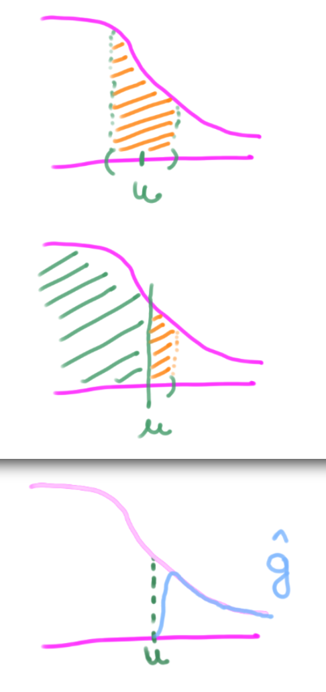

### Intuicion de distribución del máximo.

Sabemos que la forma de un histograma se aproxima a la función de densidad $f(x)$ a partir de la cual se generaron los datos $x_1, x_2, \dots, x_n$, asumiendo que son **realizaciones** de variables aleatorias $X_1, X_2, \dots, X_n \ \text{iid}$ con $X_1 \sim f$ 

```{r}
gridx <- seq(-3,3, 0.1)
hist(rnorm(1e5), prob=T, ylim=c(0,0.45), col='steelblue', main="Histograma de Datos ~ N(0,1)")
lines(gridx, dnorm(gridx), lwd=3, col='orange')
```

<!-- #region -->
En el problema de modelado de máximos, queremos encontrar una función $g(x)$ a partir de la cual se generaron los datos $\hat x_1, \hat x_2, \dots ,\hat x_m$, asumiendo que son **realizaciones** de variables aleatorias $\hat X_1, \hat X_2, \dots, \hat X_m \ \text{iid}$ con $\hat X_1 \sim g$

Siendo concretos, los datos que queremos modelar son:

    
* Los máximos en un período (bloque) dado

  * ej: "teniendo $x_i$ diarios, quiero el mayor $x_i$ de cada año"
  
* Los que sobrepasan algún umbral

  * ej: "$x_i$ mayores a 30", "$x_i$ mayores al 95 percentil"
  
Llamamos $\hat x_i$ a los $x_i$ que cumplen su condición de "**extremo**" en cualquiera de los casos.
<!-- #endregion -->

<!-- #region -->
En otras palabras, sólo estamos interesados en **la cola de la distribución**.


### Antes de pasar al siguiente ejercicio:

>  ¿Podés imaginar cómo resultaría un histograma de los **valores máximos** $\hat x_i$ que se encuentran **en la cola** de una Normal(0,1) como la anterior?
>
> ¿Podés ver por qué ésto es así? Qué sucede "alrededor" del umbral? ¿Por qué?

> > ### RTA
> > Es razonable pensar que un histograma de los valores de la cola de una Normal, será exactamente igual que recortar la cola de un histograma "completo".
> > 
> > Pero al tener un umbral que **descarta** los valores por debajo del mismo, podemos ver cómo la probabilidad (área) de caer en un entorno de $u$ se redujo a la mitad
> >
> > 
<!-- #endregion -->

# Ejercicio 1.

Realice un **histograma del percentil 90** como umbral de una muestra **Normal estándar** de `1e5` elementos.

Agregue una curva de densidad estimada $\hat g$ utilizando la función `density` sobre los **datos del histograma**.


### RTA

Realizamos un histograma de los datos por encima del umbral. Para filtrarlos:
> `datos[datos > umbral]`

```{r}
datos  <- rnorm(1e5)
umbral <- quantile(datos, 0.9, names=F)
datos_max <- datos[datos > umbral]
g_estim   <- density(datos_max, bw=0.1)
hist(datos_max, prob=T, col='steelblue', ylim=c(0, max(g_estim$y)),
     main='Histograma de valores extremos',
     xlab='valores', ylab='Frecuencia relativa')
lines(g_estim, lwd=3, col='orange')
```

# Introducción

En esta guía veremos cómo modelar una serie de datos observados usando:

1. **Máximos por Períodos** y el ***Teorema de Generalized Extreme Values (GEV)***

2. **Excesos sobre Umbral** y el ***Teorema de Generalized Pareto Distribution (GPD)***

Los datos se corresponden al dataset `Algiers`, que contiene las temperaturas máximas y mínimas diarias en el período 1961-2005. El mismo se puede descargar usando el paquete `heatwaveR`.
En particular, nos vamos a concentrar en el uso de las primeras.

# Nivel de Retorno - GEV

Como los datos sobre los que vamos a trabajar son de temperaturas máximas, sabemos que estos datos se van a ajustar bajo la metodología de GEV, particularmente con la **Familia Gumbel**.

Será de interés estimar sus parámetros característicos, y obtener un nivel de retorno para algún $z_p$

Explorando el comando `gum.fit` hallá los parámetros $\hat \sigma$ y $\hat \mu$

```{r}
#install.packages('evd')
#install.packages('ismev')
library(heatwaveR)
library(evd)
library(ismev)
```

Guardá los datos máximos diarios de la librería `heatwaveR` y filtrá del dataset `Algiers` los máximos de cada año (notá que los datos de Algiers son diarios)

```{r}
#datos <- rgumbel(1e3)
datos <- Algiers
```

```{r}
maximos_anuales <- rep(NA, times=45)
for(i in 1:45){
  anio <- as.character(1960+i)
  anio_dato <- substring(datos$t,1,4)
  maximos_anuales[i] <- max(datos$tMax[which(anio_dato==anio)])
} 
```

1 . 

Explore el comando `gum.fit` de la librería `ismev` usando los datos del ejercicio.

¿Qué valores se corresponden a las estimaciones de máxima verosimilitud? ¿Qué representa `$se`?

```{r}
gum <- gum.fit(maximos_anuales)
gum$mle
```
# Nivel de Retorno 

2. Recordá que el nivel de retorno $z_p$ es el valor que puede ser superado por el máximo anual en cualquier año, con probabilidad $p$

Reemplazá los valores estimados en la función de nivel de retorno $z_p$

Definí una función `estim_zp` que tome como input el nivel $p$ y las estimaciones de $\mu$ y $\sigma$, y devuelva el nivel de retorno $z_p$

Computá el valor de $z_p$ para las estimaciones del problema anterior usando su definición (ver pag 56 "Inference for Return Levels")

```{r}
estim_zp <- function(p, mu, sigma){
    zp <- mu - sigma * log( -log(1-p) )
    return(zp)
}
```

3. Usando la función del problema anterior, graficá $z_p$ en función de $\log(y_p)$ para una grilla de valores entre 0.01 y 0.99, usando los parámetros estimados en el ejercicio 1.

```{r}
mu    <- gum$mle[1]
sigma <- gum$mle[2]
```

```{r}
gridp <- seq(0.01, 0.99, 0.01)
m <- length(gridp)
estims <- rep(NA, m)
logyps <- rep(NA, m)
for(i in 1:m){
    p <- gridp[i]
    estims[i] <- estim_zp(p, mu, sigma)
    yp <- -log(1-p)
    logyps[i] <- log(yp)
}

```

```{r}
plot(estims, logyps, xlab=expression(z[p]), ylab=expression(log(y[p])), pch=20)
```

# Varianza del estimador e Intervalos de Confianza

Por el [Método Delta](https://es.wikipedia.org/wiki/M%C3%A9todo_delta), sabemos que: 

$$\Large \mathrm{Var}(\hat z_p)\approx \nabla z_p^T \ V \ \nabla z_p$$
Donde 

> $V$ es la matriz de varianzas-covarianzas de $\mu$ y $\sigma$ 

y

> $\large \nabla z_p^T = \left[ \frac{\partial z_p}{\partial \mu},\frac{\partial z_p}{\partial \sigma}  \right]$

Derivando el nivel de retorno $z_p$ con respecto a cada una de sus variables, obtenemos

> $\large \frac{\partial z_p}{\partial \mu} = 1$
>
> $\large \frac{\partial z_p}{\partial \sigma} = -\log\{ -\log (1-p)\}$

*(ver pag. 81-82 "4.3.3 Return Levels")*

4. Repetí lo mismo que en el ejercicio 3 pero agregando el intervalo de confianza de la estimación $\hat z_p$

Agregá la desviación estándar en el gráfico (por encima y debajo de la curva), multiplicándola por el percentil $s_{1- \frac\alpha 2}$ de una distribución Normal estándar, para un nivel de confianza del $95%$ (con $\alpha = 0.025$).

Notar que $z_{1- \frac\alpha 2}$ no es lo mismo que $s_p$, donde el primero es el **nivel de retorno**, y el segundo el **percentil de una Normal estándar**)

Intervalo de confianza del estimador de nivel de retorno $\hat z_p$:

$$\Large (\hat z_p - s_{1-\frac \alpha 2} \ \widehat {\text{se}} , \ \hat z_p + s_{1-\frac \alpha 2} \ \widehat {\text{se}})$$

Para ello, utilizá la estimación de la matriz de covarianza `$cov` que devuelve `gum.fit` junto con los gradientes del estimador $\hat z_p$ del nivel de retorno, en el producto de matrices mencionado arriba para obtener la varianza del estimador $\mathrm{Var}(\hat z_p)$

TIP: Usá el operador `%*%` para computar el producto entre matrices, `t()` para trasponer, y el comando `matrix(c(1, ds))` para generar una matriz de un array de datos.

```{r}
cov <- gum$cov

gridp <- seq(0.01, 0.99, 0.01)
m <- length(gridp)
zps <- rep(NA, m)
vars <- rep(NA, m)
logyps <- rep(NA, m)
for(i in 1:m){
    p <- gridp[i]
    du <- 1
    ds <- -log( -log(1-p) ) 
    grad_zp <- matrix( c(du, ds) )
    
    zps[i]  <- estim_zp(p, mu, sigma)
    vars[i] <- t(grad_zp) %*% cov %*% grad_zp 
    yp <- -log(1-p)
    logyps[i] <- log(yp)
}

```

```{r}
z_alpha <- qnorm(p=1-0.05)
plot(logyps,  zps, xlab=expression(log(y[p])), ylab=expression(z[p]), pch=20)
lines(logyps, zps + z_alpha * sqrt(vars))
lines(logyps, zps - z_alpha * sqrt(vars))

plot(gridp, zps, xlab=expression(p), ylab=expression(z[p]), pch=20)
lines(gridp, zps+ z_alpha * sqrt(vars))
lines(gridp, zps- z_alpha * sqrt(vars))
```

<!-- #region -->

# Bootstrap

Otra forma de obtener la desviación estándar del estimador es mediante bootstrap:

1. Sample aleatorio con reposición de mi bolsa de datos
2. Estimo el nivel de retorno para esta muestra
3. Repito 1 y 2 una gran cantidad de veces (ej: Nboot=1000)
4. Calculo la desviación estándar sobre el total de niveles de retornos obtenidos en cada iteración

```{r}
experiment <- function(X, p){
    gum   <- gum.fit(X, show=F)
    mu    <- gum$mle[1]
    sigma <- gum$mle[2]
    return( estim_zp(p, mu, sigma) )
}
```

```{r}
estim.se.f.bootstrap <- function(X, p){
    Nboot <- 1000
    m <- length(X)
    fs <- rep(NA, Nboot)
    for(i in 1:Nboot){
        X_boot <- sample(x=X, size=m, replace=T)
        fs[i]  <- experiment(X_boot, p)
    }
    #hist(fs)
    se <- sd(fs)
    return(se)
}

se_zp <- estim.se.f.bootstrap(maximos_anuales, p=0.001)
se_zp
```

```{r}
ses <- rep(NA, length(gridp))
i <- 1
for(p in gridp){
    ses[i] <- estim.se.f.bootstrap(maximos_anuales, p)
    i <- i+1
}

```
```{r}
z <- qnorm(p=1-0.025)
plot(gridp, zps, pch=20)
lines(gridp, zps - z*ses)
lines(gridp, zps + z*ses)
```

# Bonus Track

Repetí los mismos ejercicios anteriores pero considerando la distribución de Pareto.

¿Notás alguna diferencia en las estimaciónes e intervalos de confianza entre Pareto y Gumbel? ¿En qué casos habría diferencias más grandes?


# Nivel de Retorno - Pareto

Es conveniente usar escalas anuales para calcular el nivel de retorno, de forma tener una interpretación simple:

> ***El nivel de retorno anual N, es el valor que se espera superar 1 sola vez cada N años***

Partiendo de que queremos calcular el área a derecha de un umbral, de una función de densidad que aproximamos con una de la **Familia Pareto Generalizada**

$$\Large \mathrm P(X>x | X>u) = \left[ 1 + \xi \left( \frac{x-u}{\sigma} \right) \right]^{-1/\xi}$$

usando definición de probabilidad condicional e igualando a $\frac 1 n$, obtenemos para el caso $\xi=0$

$$\Large z_n = u + \sigma \log (N \ n_y \ \mathrm P(X>u))$$

*(página 81 en Coles & Trener)*
<!-- #endregion -->

Estimar los parámetros usando la función `gpd` de la librería `evir` (o alguna equivalente).
